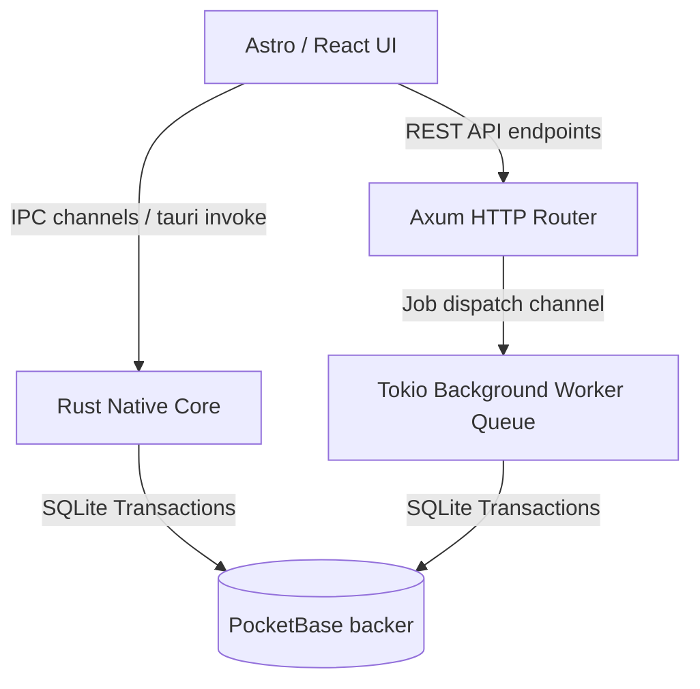

# E2E Delivery & Verification Playbook: yt-upload-manager

This playbook serves as a permanent architectural master record and operational handbook for setting up, building, testing, installing, and verifying every layer of the **yt-upload-manager** application.

---

## 🏛️ System Architecture Overview

The system is a multi-tenant microservices architecture designed to run in two completely distinct native operational modes:



1. **Target 1: Tauri Native Desktop Application (GUI Mode)**:
   A native desktop app wrapper (`.dmg`/`.app`/`.exe`) that bundles the frontend user interface and communicates directly with the operating system using Rust Tauri commands (`invoke`).
2. **Target 2: Headless Standalone Server (API Mode)**:
   A headless backend REST server running **Axum** which serves APIs, schedules concurrent background uploads using **Tokio background threads**, and connects directly to the database.

---

## 🗄️ Database & Schema Design

### Hungarian Naming Notation
To maintain type clarity across React, TypeScript, and Rust, collections and database fields use strict Hungarian-style type prefix naming conventions:

* **Scope/Tenant Prefix**:
  * `t_app_settings` (tenant-scoped, local configuration properties KV store).
  * `s_channels` (system-wide YouTube Channel settings).
  * `s_batches` (system-wide bulk video uploading queues).
  * `s_staged_videos` (system-wide staged video queues).
* **Attribute Types**:
  * `is_archived` (boolean prefix).
  * `batch_id` / `channel_id` (relational ids).
  * `last_sync_at` (date prefix).
  * `metadata_json` (json prefix).

### Name-Mangled Brotli-Base64 Compression
To save local SQLite storage and protect credentials, all large-form or sensitive text fields are dynamically compressed via **Brotli** and stored as **Base64** text, using a name-mangled suffix `*_brotli_b64` so that all layers of the app are explicitly aware of the data type:
* `youtube_config_brotli_b64` (OAuth credentials).
* `description_brotli_b64` (Video description).

---

## 🚀 The E2E Operational Sequence

### Phase 1: Clean Installation & Setup
Run the project initialization to download the backing databases, install frontend npm packages, Cargo crates, and sync bindings:
```bash
just setup
```

### Phase 2: backing Database Boot & Health Check
Start your backing database in the background to act as the tenant storage node:
```bash
just up
```
* **Verify Health**: Open http://127.0.0.1:8090/_/ in your browser.
* **Credentials**:
  * **Email**: `admin@yt-manager.com`
  * **Password**: `admin123456`

### Phase 3: E2E Automated Stack Diagnostics
We implemented an automated diagnostics runner that executes a complete integration sanity check (boots a temp DB, applies migrations, compiles the Rust server, verifies HTTP endpoints, tests Tokio workers, and cleans up):
```bash
just verify-stack
```
*Look for `🟢 SUCCESS` checkmarks on every component of the report.*

### Phase 3.5: Tauri GUI Native Target & PROD DB Connection Check
We implemented a dedicated integration verification script that compiles the actual native release binary, launches it in a production-configured environment targeting the Pockethost database instance, scans its output log streams to verify the connection initiates correctly without crashes, and shuts down safely:
```bash
just verify-gui
```
*Look for `🟢 SUCCESS` checkmarks under compilation, launch success, and production DB URL logs check.*

---

## 🖥️ Target 1: Tauri Native Desktop Application (GUI Mode)

### A. Run in Development Mode (Live Hot-Reload)
```bash
just tauri
```

### B. Compile the Production Native Target
Compile the optimized installer matching your OS:
```bash
just build-tauri
```
* Native binaries compile inside: `src-tauri/target/release/bundle/`
* **macOS disk image installer**: `/src-tauri/target/release/bundle/dmg/yt-upload-manager_0.1.0_aarch64.dmg`
* **macOS local application bundle**: `/src-tauri/target/release/bundle/macos/yt-upload-manager.app`

---

## 📡 Target 2: Headless Standalone Server (REST API Mode)

The standalone target runs headless on your machine or container. It features **SimpleLogger**, a custom stdout logging utility we wrote in Rust to output formatted console traces in server mode.

### A. Compile Headless Release Target
```bash
just build-web
cd src-tauri
cargo build --release --bin app
```

### B. Start the headless Server
```bash
PORT=8080 APP_MODE=server YT_DUMMY_MODE=true ./target/release/app
```
*Verify that the console outputs database URL logs and highlights the environment status.*

### C. Run E2E Endpoint Connection Verifications

Open a separate terminal window and check that the server API works and connects to the DB:

#### Check A: Fetch System Status API
Query the Axum `/api/status` endpoint:
```bash
curl -s http://127.0.0.1:8080/api/status | json_pp
```
*Returns active system monitor stats (CPU, Memory, Active Jobs, Uptime).*

#### Check B: Queue a Staged Upload Metadata Job
Submit a test upload job to the REST API queue:
```bash
curl -s -X POST -H "Content-Type: application/json" \
  -d '{
    "job_type": "VideoUpload",
    "channel_id": "ch-e2e-delivery",
    "title": "Headless Server E2E Delivery Run",
    "description": "Verifying that the Axum server connects to DB and processes jobs.",
    "privacy_status": "private",
    "license": "youtube",
    "embeddable": true,
    "public_stats_viewable": true,
    "made_for_kids": false,
    "contains_synthetic_media": false,
    "paid_product_placement": false,
    "tags": ["e2e", "verification"],
    "category_id": "22",
    "sub_details": {},
    "compressed_fields": []
  }' \
  http://127.0.0.1:8080/api/jobs | json_pp
```
*Returns `{"video_id": "queued", "status": "Processing"}`.*

#### Check C: Inspect Tokio Worker Logs
Check the server stdout console logs to confirm the background thread picked up and completed the queue job successfully:
```text
2026-06-01 01:33:36 [INFO] - Rust Worker: Queueing VideoUpload job for Headless Server E2E Delivery Run
2026-06-01 01:33:36 [INFO] - Starting execution of VideoUpload for Headless Server E2E Delivery Run
2026-06-01 01:33:36 [INFO] - 🎬 [YouTube API] Initializing Resumable Video Upload for: Headless Server E2E Delivery Run
2026-06-01 01:33:41 [INFO] - Successfully completed VideoUpload for Headless Server E2E Delivery Run
```

---

## 🐙 CI/CD Integration (GitHub Actions Pipeline)

The dynamic configuration stack checks (`verify-stack`) and native target connectivity verifications (`verify-gui`) are officially registered as package scripts in `package.json` and integrated directly into the automated **GitHub Actions CI/CD workflow** (`.github/workflows/ci.yml`).

### CI/CD Diagnostic Workflow
Every single pull request or push onto `main`, `development`, or any `feature/**` branch triggers a complete, multi-platform test runner matrix executing concurrently across **macOS, Windows, and Linux**:

1. **Security Scan**: Audits npm packages and Rust crates (`cargo audit`) for vulnerabilities.
2. **Environment Verification**: Sets up stable Rust, Bun, Node, and compiles cache systems.
3. **Unit Tests**: Runs `bun run test` (executing all 30/30 unit tests with mock database layers).
4. **Integration Tests**: boots isolated databases and runs migrations to verify transactional layers.
5. **E2E Stack Diagnostics**: Runs `bun run verify-stack` to check dynamic REST routers and background Tokio thread pipelines.
6. **PROD DB & Native GUI checks**: Runs `bun run verify-gui` which compiles the native backend target, spawns it under production settings, and verifies connectivity to Pockethost.
7. **Release Packaging**: Packages production native installers (`.dmg`/`.exe`/`.deb`/`AppImage`) and uploads them as official Github release assets!

---

## 📑 Next Agent Handover & Pick-Up Guide

> [!NOTE]
> **Instructions for the Next AI Coding Assistant**:
> The project architecture is in a highly pristine state. All tests pass with 100% success.
> Use this handbook to orient yourself before making changes.

### Essential Code Files & Locations
* **`src/lib/dynamic_config.ts`**: The 12-factor MicroProfile Config system resolving process envs, `microconfig.json`, and PocketBase dynamic properties.
* **`src/lib/pocketbase.ts`**: Backing SQLite database services with custom high-visibility console startup logs.
* **`src-tauri/src/lib.rs`**: Core Tauri commands, Axum standalone HTTP router, and Tokio concurrent worker threads. Contains `SimpleLogger` for server-mode stdout printing.
* **`scripts/verify-stack.ts`**: E2E automated stack diagnostics runner script.

### Verified Test Files
* **`src/lib/dynamic_config.test.ts`**: Comprehensive unit test harness for the dynamic configuration service (100% success).
* **`src/test/dynamic_config_integration.test.ts`**: Dynamic config prioritizations and live DB backer property fallbacks (100% success).
* **`src/test/bulk_staging_integration.test.ts`**: Brotli-compressed staged live-broadcast uploads pipeline (100% success).
* **`src/test/integration_pocketbase.test.ts`**: Staged channels and batches database transactions (100% success).

### Clean Cleanup Procedure
To stop all databases and web servers cleanly:
```bash
just db-stop
```
